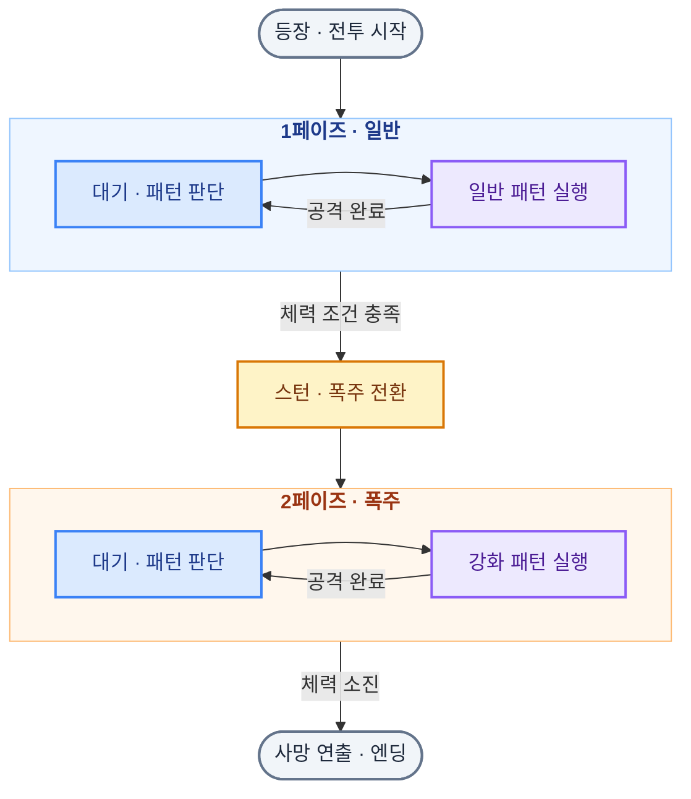

# IRA 모작 — DirectX 9 팀 프로젝트

쿼터뷰 탄막 액션 게임 **IRA(이라)를 모작한 C++ · DirectX 9 팀 프로젝트**입니다. 
**공통 프레임워크의 구성/확장**, **최종보스**, **메인·상호작용 UI**를 담당하고 **인벤토리 공동 구현**과 **팀 코드 통합**에 참여했습니다.

## [**GitHub Repository**](https://github.com/Nu-LungJi/Software-Rendering-Project)
## [**게임 시연 영상 (Demo Video) **](https://youtu.be/kG5w627sZeI)

| 항목      | 내용                                                                 |
| ------- | ------------------------------------------------------------------ |
| 개발 기간   | 2026.01.30 ~ 2026.03.08 (5주)                                       |
| 개발 인원   | 5인 팀 프로젝트                                                          |
| 플랫폼     | Windows PC / x64                                                   |
| 프로젝트 구성 | 공통 기능의 `Engine.dll` + 게임 로직의 `Client.exe`                          |
| 주요 담당   | 프레임워크 구성·확장, 최종보스, 메인·상호작용 UI                                      |
| 사용 기술   | C++ · Win32 API · DirectX 9(API) ·  FMOD(Sound) · Dear ImGui(Tool) |
| 제작 보조   | Git/GitHub(협업), PhotoShop(리소스 편집)                                  |

프레임워크에는 팀원들의 확장·수정이 함께 포함되어 있으며, 인벤토리는 기존 UI를 기반으로 공동 구현했습니다. 팀 코드 병합과 기능 통합에 참여하고, 카메라·플레이어·일반 몬스터·천록·맵·미니게임의 필요한 연동과 동작을 수정했습니다.

## 주요 기술 구현

| 번호    | 기술                     | 핵심 구현                                        |
| ----- | ---------------------- | -------------------------------------------- |
| **1** | **Component 기반 프레임워크** | Engine·Client 분리, 계층별 객체 관리, 컴포넌트 복제와 리소스 공유 |
| **2** | **AABB 충돌·콜백 처리**      | 충돌 진입·유지·이탈 콜백을 통한 피격·상호작용 처리                |
| **3** | **최종보스 페이즈 · FSM**     | 일반·폭주 페이즈 전환, 상태별 공격 패턴과 등장·사망 연출            |
| **4** | **프레임·타이머 기반 전투 연출**   | 공격 실행 시점 제어, 시간차 공격, 실행 플래그를 통한 중복 실행 제어     |
| **5** | **스프라이트 이펙트·렌더 순서**    | 전면·후면 이펙트 분리, 재생·충돌 등록 관리, 출력 순서 제어          |
| **6** | **게임 상태·상호작용 UI**      | 상태 표시, NPC 대화·팝업, 인벤토리 데이터 연동과 화면 전환         |

### 1. 컴포넌트 기반 프레임워크

게임 로직을 담당하는 **Client와 공통 기능을 제공하는 Engine을 분리**했습니다. `Scene → Layer → GameObject` 계층으로 객체를 관리하고, 각 객체에 `Component`(Transform·Buffer·Texture·Collider)를 추가시키도록 구현했습니다.

- **컴포넌트 복제:** `ProtoManager`에 게임 Initialize 시점에 등록한 원본 컴포넌트들을 `Clone`해 객체에 컴포넌트를 부여하도록 만들었습니다.
- **리소스 공유:** `ResourceManager`에서 공용 텍스처를 조회하고 캐싱합니다.
- **등록·해제 관리:** 객체를 렌더 그룹에 등록하고, 참조 카운트 규약에 맞춰 등록·해제 시점을 관리합니다.

관련 코드: [ProtoManager.cpp](https://github.com/Lung-Ji/Software-Rendering-Project/blob/master/Engine/Code/ProtoManager.cpp) · [ResourceManager.cpp](https://github.com/Lung-Ji/Software-Rendering-Project/blob/master/Engine/Code/ResourceManager.cpp) · [RenderManager.cpp](https://github.com/Lung-Ji/Software-Rendering-Project/blob/master/Engine/Code/RenderManager.cpp)

### 2. AABB 충돌과 콜백 기반 피격·상호작용

`CollisionManager`에서 **AABB 충돌을 검사하고, 충돌 단계에 따른 콜백 함수를 게임 객체에 연결**했습니다. 객체는 콜백을 통해 피격과 상호작용을 처리하도록 하였고, 진입 -> 유지 -> 이탈 순으로 충돌 로직이 실행되도록 만들었습니다.

| 콜백 | 처리 시점 |
|---|---|
| `OnCollisionEnter` | 충돌 진입 |
| `OnCollisionStay` | 충돌 유지 |
| `OnCollisionExit` | 충돌 이탈 |

공격 이펙트에는 Collider를 연결하고, 애니메이션 종료 구간에서 충돌 등록을 해제하도록 구성했습니다.

관련 코드: [CollisionManager.cpp](https://github.com/Lung-Ji/Software-Rendering-Project/blob/master/Engine/Code/CollisionManager.cpp) · [BossEffect.cpp](https://github.com/Lung-Ji/Software-Rendering-Project/blob/master/Client/Code/BossEffect.cpp)

### 3. 최종보스의 페이즈 전환과 상태 머신

최종 보스는 `FinalBoss` 클래스를 중심으로 구현했습니다. **체력·타이머·행동 가능 상태에 따라 패턴을 선택**하고,  `StateMachine` 클래스에서 상태의 진입·갱신·종료 함수에서 애니메이션과 연출을 전환합니다.

최종 보스의 공격 루틴과 전환 흐름을 요약하여 그래프로 아래 정리해보았습니다.

- **일반 페이즈:** 휘두르기·지면 폭발·메테오 공격을 구성했습니다.
- **폭주 페이즈:** 체력 조건에 따라 전환하고, 강화 탄막·연속 폭발·서포터 패턴을 실행합니다.
- **등장/사망:** 등장 시 플레이어 조작 정지·카메라 이동·보스 타이틀을 연결하고, 사망 시 진행 중인 공격을 정리한 뒤 사망 연출과 엔딩으로 이어지도록 구성했습니다.

관련 코드: [FinalBoss.cpp](https://github.com/Lung-Ji/Software-Rendering-Project/blob/master/Client/Code/FinalBoss.cpp) · [StateMachine.cpp](https://github.com/Lung-Ji/Software-Rendering-Project/blob/master/Client/Code/StateMachine.cpp)

### 4. 프레임·타이머 기반 전투 연출

애니메이션의 **현재·이전 프레임 비교**와 **패턴별 타이머·실행 플래그**를 함께 사용해 공격과 연출의 실행 시점을 제어했습니다.

- **프레임 연동:** 지정된 프레임에 투사체·이펙트·사운드를 실행합니다.
- **시간차 공격:** 경고 영역 표시 → 메테오 생성 → 폭발처럼 시간차가 필요한 동작을 단계로 나눕니다.
- **중복 실행 제어:** 단계별 실행 플래그로 같은 타이머 조건에서 동작이 반복 실행되는 것을 제어합니다.
- **화면 연출 연동:** 등장·사망 시 플레이어 조작, 카메라 이동·흔들림, 체력바·페이드를 함께 조율합니다.

관련 코드: [FinalBoss.cpp](https://github.com/Lung-Ji/Software-Rendering-Project/blob/master/Client/Code/FinalBoss.cpp) · [BossEffect.cpp](https://github.com/Lung-Ji/Software-Rendering-Project/blob/master/Client/Code/BossEffect.cpp)

### 5. 스프라이트 이펙트와 렌더 순서

`EffectManager`에서 플레이어·몬스터·보스 전면·보스 후면·UI 이펙트를 구분했습니다. **보스 후면 이펙트 → 알파 객체 → 보스 전면 이펙트** 순서로 출력해 바닥 경고·몸체·화염이 겹치는 순서를 조절했습니다.

- **재생 제어:** 텍스처 시퀀스에 재생 시간과 반복 여부를 적용합니다.
- **충돌 연동:** 공격 이펙트에 Collider를 연결하고, 애니메이션 종료 구간에서 충돌 등록을 해제합니다.
- **이펙트 정리:** 재생이 끝난 이펙트를 정리하고, 렌더 그룹에 따라 출력 순서를 관리합니다.

관련 코드: [EffectManager.cpp](https://github.com/Lung-Ji/Software-Rendering-Project/blob/master/Engine/Code/EffectManager.cpp) · [BossEffect.cpp](https://github.com/Lung-Ji/Software-Rendering-Project/blob/master/Client/Code/BossEffect.cpp) · [RenderManager.cpp](https://github.com/Lung-Ji/Software-Rendering-Project/blob/master/Engine/Code/RenderManager.cpp)

### 6. 게임 상태·상호작용 UI와 데이터 연동

**플레이어·보스의 상태를 UI에 표시하고, UI 입력 결과를 게임 오브젝트에 반영**했습니다. 메인 UI와 상호작용 UI를 구현하고, 인벤토리는 기존 UI를 기반으로 팀원과 공동 구현했습니다.

| UI           | 구현 내용                                       |
| ------------ | ------------------------------------------- |
| 메인/보스 UI     | 체력·재화·스킬 표시, 보스 타이틀과 체력바 동기화                |
| 대화/상호작용      | NPC 대화 진행, 입력 가이드, 아이템 상호작용/획득/구매 팝업        |
| 인벤토리 — 공동 구현 | 보관·장착 슬롯 선택, 아이템 교환·삭제, 플레이어 데이터 연동         |
| 화면 전환        | 필터 텍스쳐의 불투명도 변화(FadeIn, FadeOut)를 게임 진행에 연결 |

관련 코드: [MainUI.cpp](https://github.com/Lung-Ji/Software-Rendering-Project/blob/master/Client/Code/MainUI.cpp) · [NPCTalk.cpp](https://github.com/Lung-Ji/Software-Rendering-Project/blob/master/Client/Code/NPCTalk.cpp) · [PlayerInven.cpp](https://github.com/Lung-Ji/Software-Rendering-Project/blob/master/Client/Code/PlayerInven.cpp)

## 원작 및 리소스

원작은 ABShot / Nicalis, Inc.의 [IRA(이라)](https://store.steampowered.com/app/1536210/)입니다. 본 프로젝트는 학습·포트폴리오용 모작이며, 원작 리소스와 외부 라이브러리의 권리는 각 권리자에게 있습니다.
